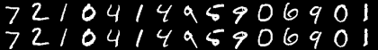
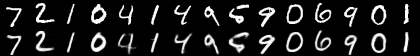
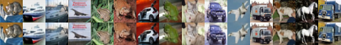

# NeuralCompression

Evaluation of neural methods for task-oriented compression of radio astronomy data. 

This implementation uses [PyTorch Lightning](https://lightning.ai/docs/pytorch/stable/) and [Weights and Biases](https://wandb.ai).

---

### Usage

To run: 

```bash
python main.py --config configs/baseline.cfg
```

Configuration files can be found in the [`configs` directory]().

<ins>Config Files</ins>

| Filename | Description | 
| :---:   | :---: |
| `baseline.cfg` | Vanilla Autoencoder (AE)  | 
| `vae.cfg` | Variational Autoencoder (VAE) |  
| `vqvae.cfg` | Vector Quantized Variational Autoencoder (VQ-VAE)  |  

---

### Models

All models have the encoder-decoder architecture defined in [van den Oord+ 2017](https://arxiv.org/pdf/1711.00937).

---

### Performance

Performance is evaluated on a reserved test set in each case. No hyper-parameter tuning is performed. 

<ins>MNIST</ins>

| Model | Data | Reconstruction Loss | Example Images (top: input; bottom: output) |
| :---:   | :---: | :---: | :---: |
| AE | MNIST  | 0.7352 |  |
| VAE | MNIST | 3.18087 |  |
| VQ-VAE | MNIST | |  |

<ins>CIFAR-10</ins>

| Model | Data | Reconstruction Loss |Example Images (top: input; bottom: output) |
| :---:   | :---: | :---: |:---: |
| AE | CIFAR-10  | 7.16751 |  |
| VAE | CIFAR-10 | | |
| VQ-VAE | CIFAR-10 | ||  

<ins>RGZ</ins>

| Model | Data | Reconstruction Loss |Example Images (top: input; bottom: output) |
| :---:   | :---: | :---: |:---: |
| AE | RGZ  | |  |
| VAE | RGZ | | |
| VQ-VAE | RGZ | | |  

---


